Muhammad Rafi Sugianto / 2406357135

<b>Screenshots</b>

Test Plan 1

- Graph Results

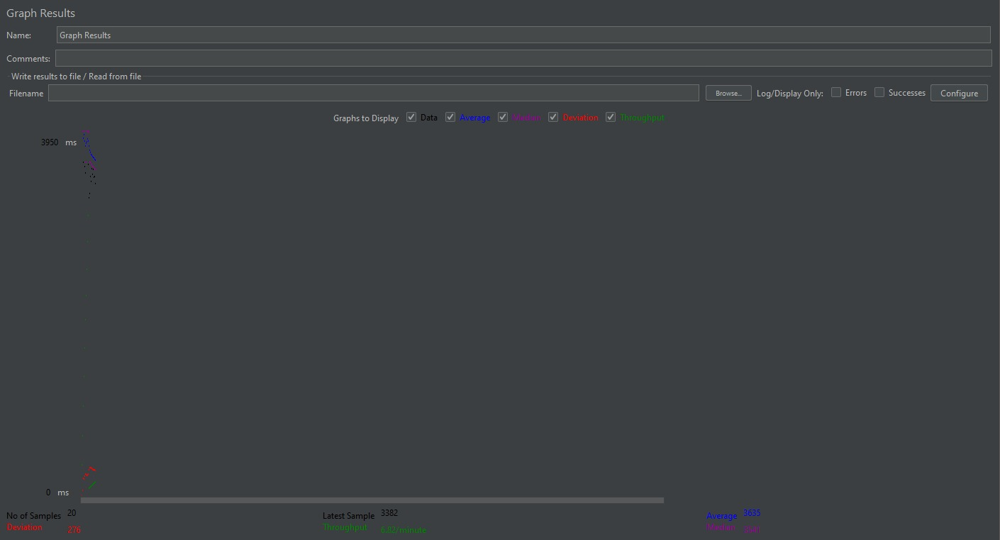

- Results in Table

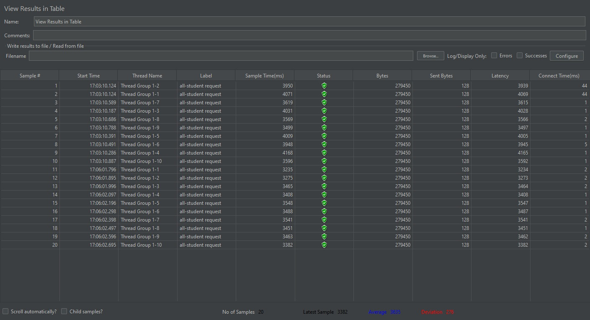

- Results Tree

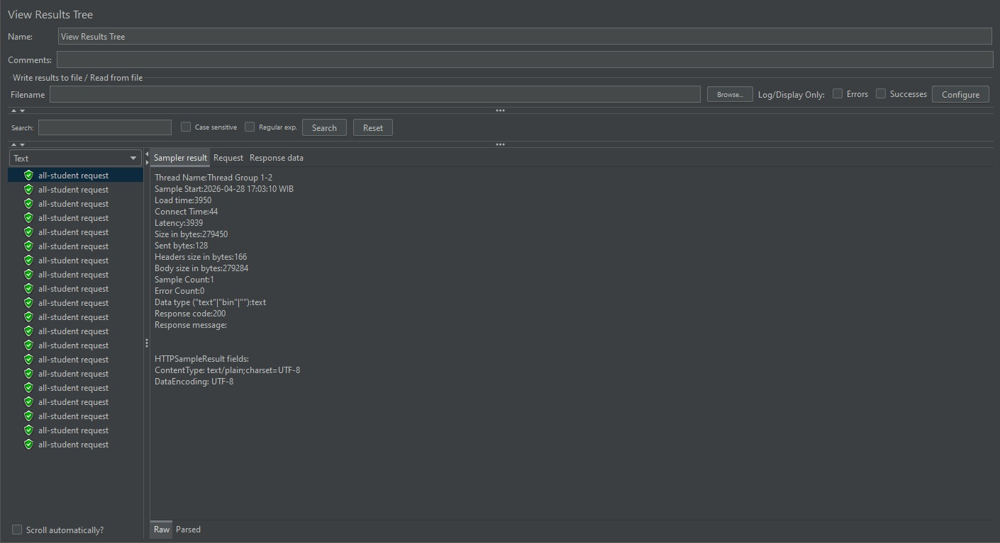

- Summary Report

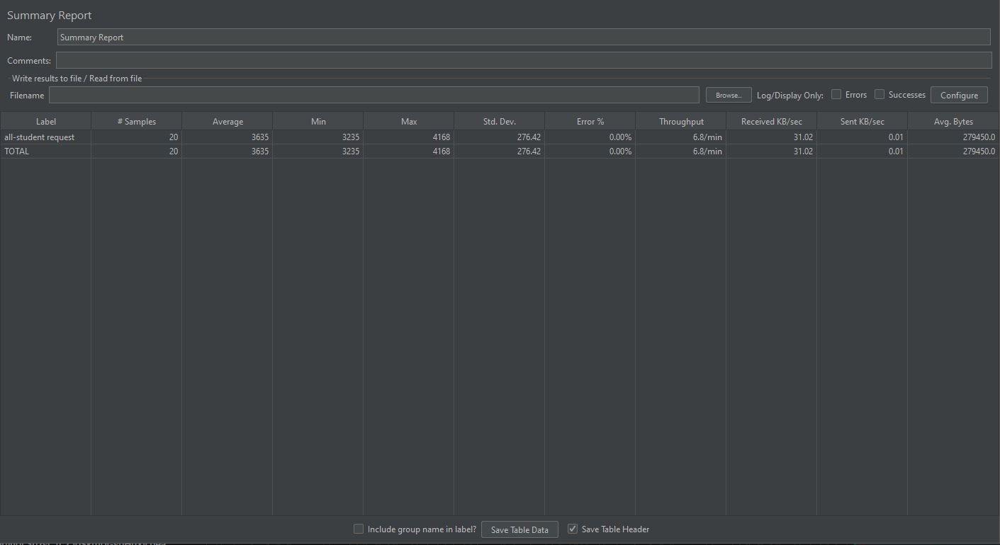

- Running Test Plan Via Command Line

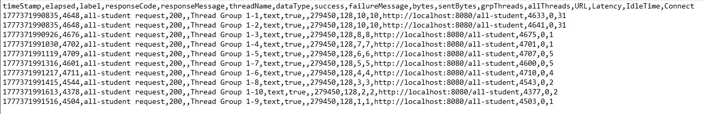

- CPU Time of getAllStudentsWithCourses() Before Optimization

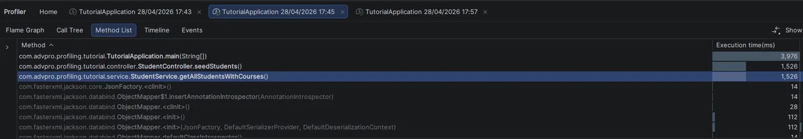

- CPU Time of getAllStudentsWithCourses() After Optimization

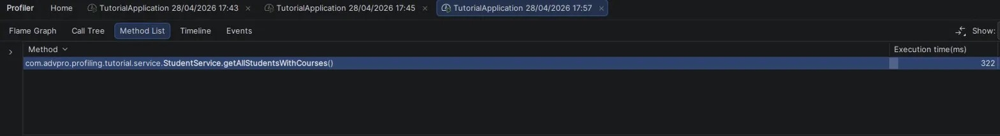

- Test Plan After Optimization

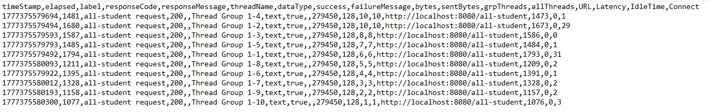

Test Plan 2 (/all-student-name)

- Graph Results

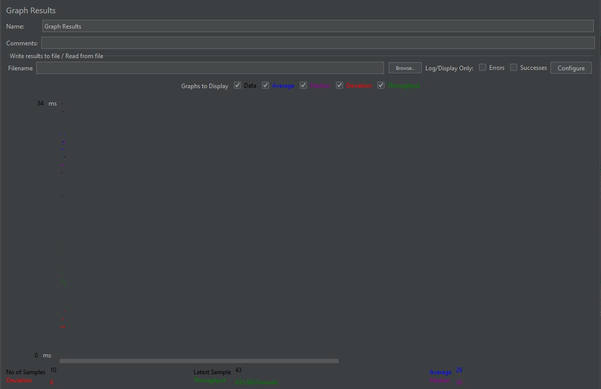

- Results in Table

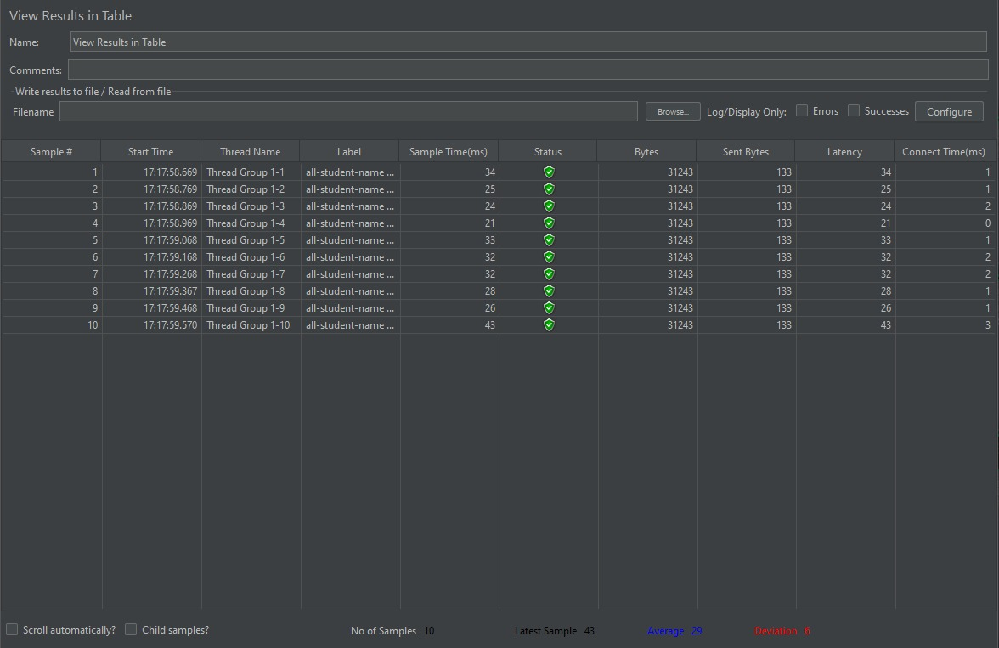

- Results Tree

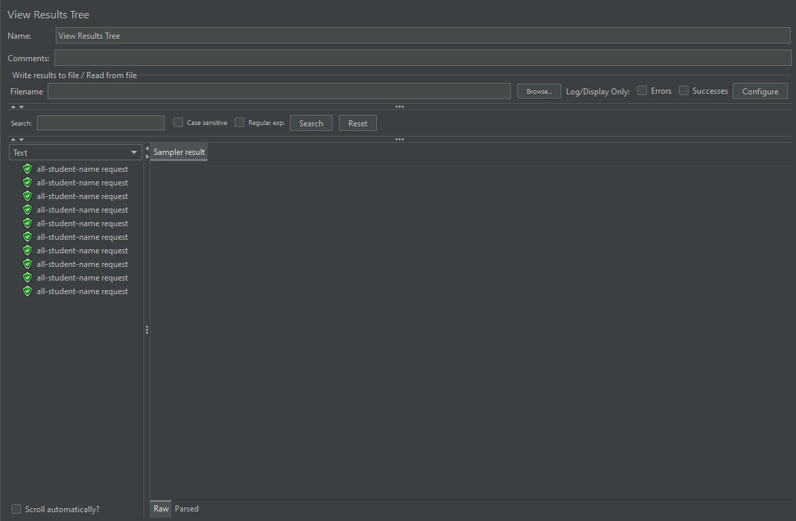

- Summary Report

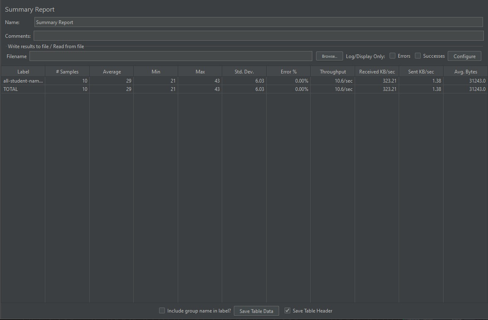

- Running Test Plan Via Command Line

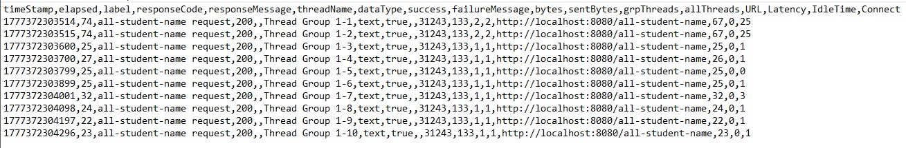

- CPU Time of joinStudentNames() Before Optimization

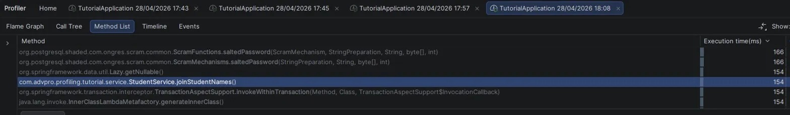

- CPU Time of joinStudentNames() After Optimization

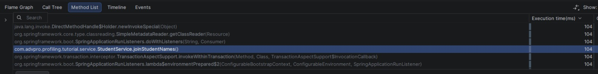

- Test Plan After Optimization

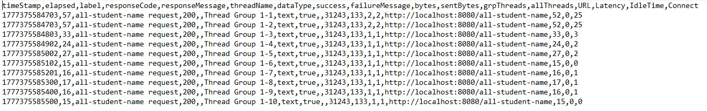

Test Plan 3 (/highest-gpa)

- Graph Results

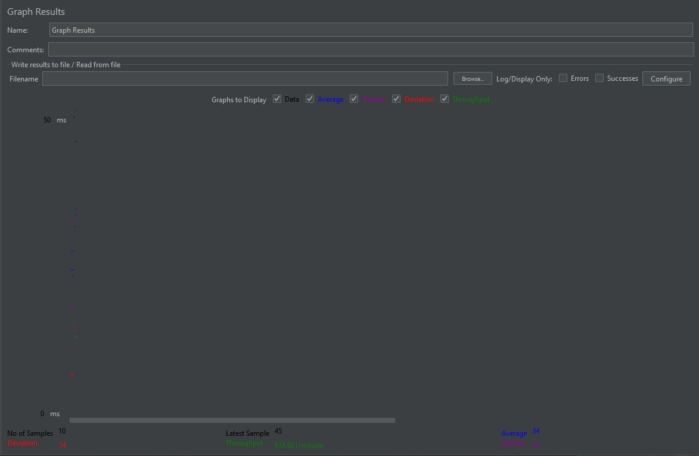

- Results in Table

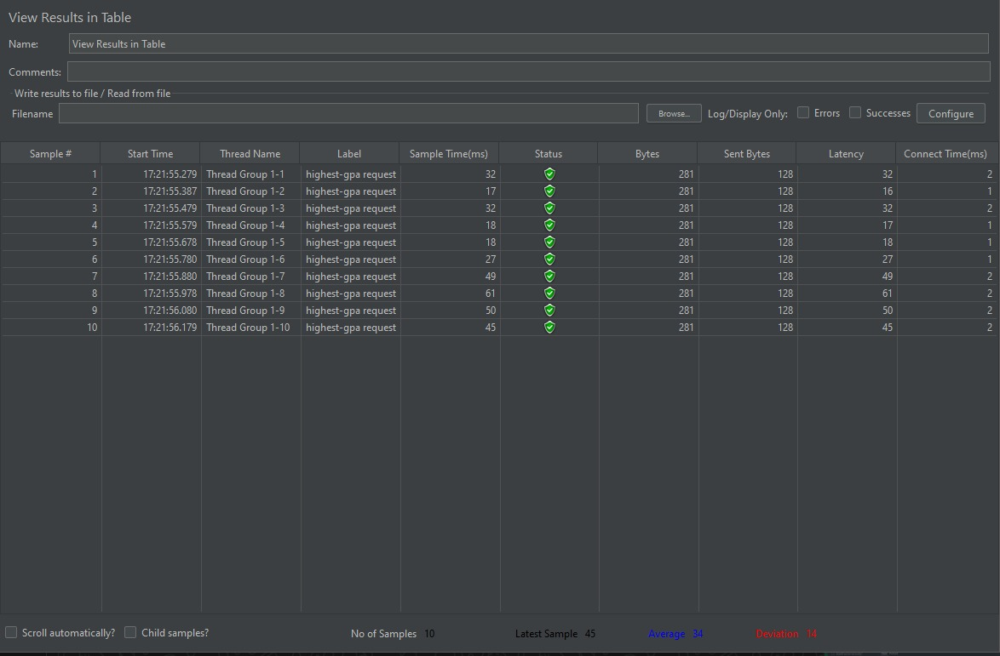

- Results Tree

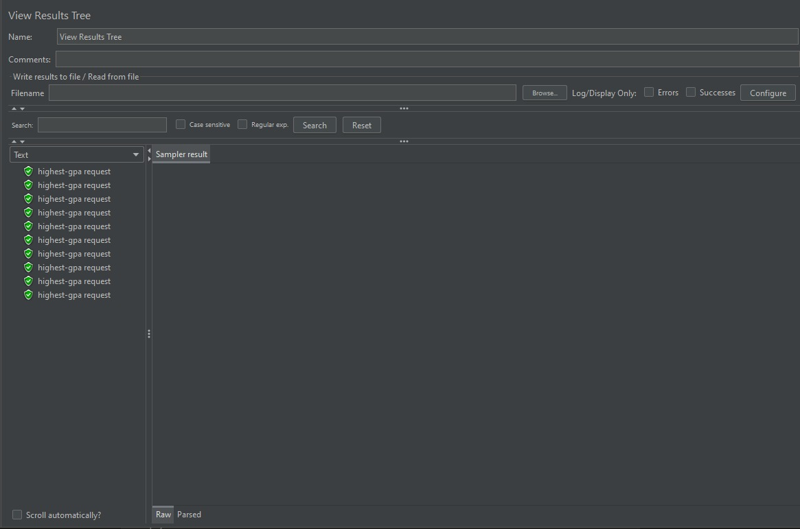

- Summary Report

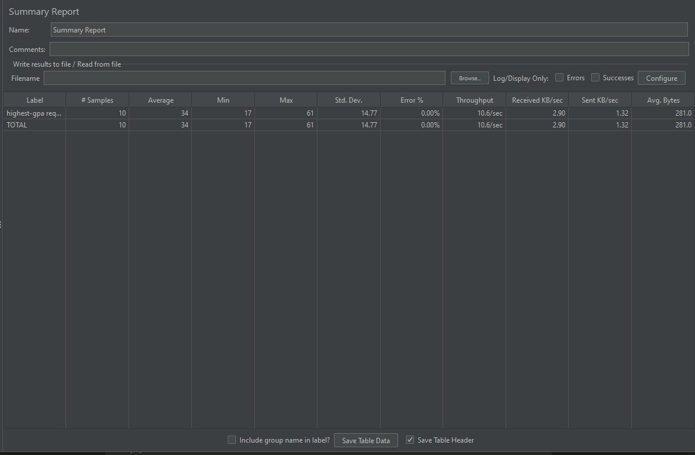

- Running Test Plan Via Command Line

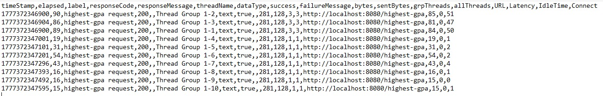

- CPU Time of findStudentWithHighestGpa() Before Optimization

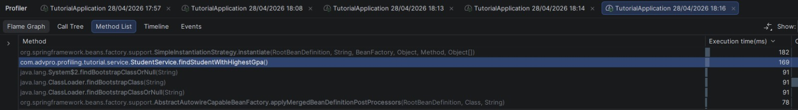

- CPU Time of findStudentWithHighestGpa() After Optimization

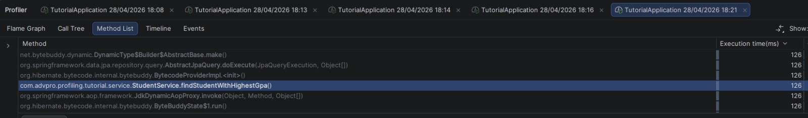

- Test Plan After Optimization

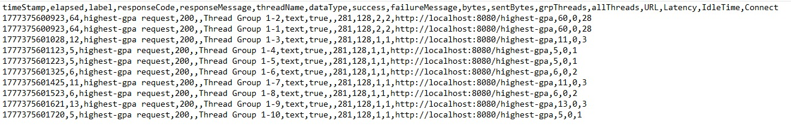

<b>Conclusion</b>

Setelah melakukan optimasi pada ketiga endpoint, berikut adalah perbandingan hasil pengujian performa menggunakan JMeter sebelum dan sesudah optimasi:

getAllStudentsWithCourses: 
- sebelum = 1526 ms
- sesudah = 322 ms
- peningkatan = 78.9%

joinStudentNames: 
- sebelum = 154 ms
- sesudah = 104 ms
- peningkatan32.5%

findStudentWithHighestGpa:
- sebelum = 169 ms
- sesudah = 126 ms
- peningkatan = 25.4%

Perhatikan bawha terdapat peningkatan yg signifikan dari hasil pengukuran JMeter setelah dilakukan optimasi. Peningkatan terbesar terjadi pada endpoint `/all-student` dengan peningkatan sebesar 78.9%, hal ini disebabkan karena sebelumnya terdapat N+1 query problem di mana setiap student melakukan query tambahan ke database. Setelah dioptimasi dengan mengganti menjadi single query `findAll()`, waktu eksekusi turun drastis dari 1526 ms menjadi 322 ms.

Endpoint `/all-student-name` mengalami peningkatan sebesar 32.5%, dari 154 ms menjadi 104 ms, setelah mengganti string concatenation dengan `+=` menjadi `StringBuilder` yg lebih efisien dalam penggunaan memory.

Endpoint `/highest-gpa` mengalami peningkatan sebesar 25.4%, dari 169 ms menjadi 126 ms, setelah mengganti iterasi manual mencari GPA tertinggi dengan database query langsung menggunakan `findTopByOrderByGpaDesc()`.

Kesimpulannya, optimasi yg dilakukan pada level memberikan dampak positif pada aplikasi, ketiga endpoint berhasil mencapai peningkatan performa lebih dari 20% yg menjadi target minimum pada modul ini.

<b>1. What is the difference between the approach of performance testing with JMeter and profiling with IntelliJ Profiler in the context of optimizing application performance?</b>

Jawab: JMeter dan IntelliJ Profiler memiliki pendekatan yg agak berbeda utk optimasi performa aplikasi.
JMeter berfokus pada pengujian performa dari sisi eksternal dengan cara mensimulasikan banyak pengguna yg mengakses endpoint secara bersamaan. JMeter mengukur metrik seperti response time, throughput, dan error rate. Dengan JMeter, kita dapat melihat bagaimana aplikasi berperilaku dengan menentukan beban tertentu, namun kita tidak dapat melihat secara detail apa yg terjadi di dalam kode.
Sebaliknya, IntelliJ Profiler bekerja dari sisi internal aplikasi. Profiler akan merekam eksekusi kode secara langsung dan memberikan informasi detail seperti CPU time dan execution time per method. Dengan begitu kita dapat mengidentifikasi method mana yg paling banyak mengonsumsi resource.

<b>2. How does the profiling process help you in identifying and understanding the weak points in your application?</b>

Jawab: Proses profiling sangat membantu dalam mengidentifikasi titik lemah aplikasi krn profiler akan merekam secara detail waktu eksekusi setiap method yg dipanggil. Misalnya pada modul ini, ketika saya melakukan profiling pada endpoint `/all-student`, saya dapat melihat di Method List bahwa method `getAllStudentsWithCourses()` memiliki CPU time yg sangat tinggi yaitu 1526 ms. Dari sana saya dapat langsung membuka source code method tersebut dan menganalisis penyebabnya. Tanpa profiling, saya mungkin hanya tahu bahwa aplikasi lambat, tetapi tidak tahu di bagian mana tepatnya. Profiling membantu mempersempit pencarian sehingga optimasi bisa dilakukan  scr efisien dan tepat.

<b>3. Do you think IntelliJ Profiler is effective in assisting you to analyze and identify bottlenecks in your application code?</b>

Jawab: Ya, IntelliJ Profiler efektif dalam membantu menganalisis dan mengidentifikasi bottleneck dalam kode aplikasi. Meurut saya ada beberapa fitur yg sangat membantu, antara lain Flame Graph yg secara visual menunjukkan method mana yg paling banyak mengonsumsi resource, Method List yg menampilkan execution time setiap method secara terurut, dan fitur comparison view yg memudahkan perbandingan hasil profiling sebelum dan sesudah optimasi.

Pada modul ini, dengan IntelliJ Profiler saya berhasil mengidentifikasi tiga bottleneck utama, yaitu N+1 query problem pada `getAllStudentsWithCourses()`, string concatenation yg tidak efisien pada `joinStudentNames()`, dan iterasi manual untuk mencari GPA tertinggi pada `findStudentWithHighestGpa()`. Ketiga bottleneck tersebut berhasil dioptimasi sehingga mencapai peningkatan performa lebih dari 20%.

<b>4. What are the main challenges you face when conducting performance testing and profiling, and how do you overcome these challenges?</b>

Jawab: Terdapat beberapa tantangan utama yg saya hadapi selama proses performance testing dan profiling, diantaranya adalah sebagai berikut.

Pertama, hasil profiling yg tidak konsisten pada pengukuran awal karena JIT compiler pada JVM belum optimal saat aplikasi pertama kali dijalankan. Cara mengatasinya adalah dengan menjalankan aplikasi beberapa kali terlebih dahulu sebelum mengambil pengukuran, seperti yg disarankan dalam modul.

Kedua, proses data seeding sangat lama krn jumlah data yg terlalu besar, yaitu 20000 student. Cara mengatasinya adalah dengan mengurangi jumlah data menjadi 1000 students di file `DataSeedService.java` agar proses seeding lebih cepat tpi tetap representatif untuk testing.

<b>5. What are the main benefits you gain from using IntelliJ Profiler for profiling your application code?</b>

Jawab: Terdapat beberapa manfaat utama yg saya dapatkan dari penggunaan IntelliJ Profiler, diantaranya adalah sebagai berikut.

Pertama, profiler memungkinkan saya melihat secara detail waktu eksekusi setiap method, sehingga saya dapat dengan cepat menemukan bagian kode yg menjadi bottleneck.

Kedua, kemudahan penggunaan karena IntelliJ Profiler sudah terintegrasi langsung dengan IDE sehingga tidak perlu setup tambahan. Cukup klik "Run with Profiler" dan hasilnya langsung tersedia.

Ketiga, fitur comparison view yg memudahkan perbandingan hasil profiling sebelum dan sesudah optimasi, sehingga saya dapat memverifikasi apakah optimasi yg dilakukan benar-benar memberikan peningkatan performa yg signifikan.

<b>6. How do you handle situations where the results from profiling with IntelliJ Profiler are not entirely consistent with findings from performance testing using JMeter?</b>

Jawab: Ketidakkonsistenan antara hasil IntelliJ Profiler dan JMeter bisa saja terjadi karena keduanya mengukur aspek ygberbeda dari performa aplikasi. IntelliJ Profiler mengukur CPU time dari sisi internal kode, sedangkan JMeter mengukur response time dari sisi eksternal termasuk network latency, serialisasi JSON, dst. Oleh karena itu, bisa saja jika terdapat perbedaan antara keduanya.

Cara menghandle situasi ini adalah dengan tidak hanya bergantung pada satu alat saja. Saya menggunakan, melainkan keduanya. IntelliJ Profiler digunakan untuk mengidentifikasi dan mengoptimasi bottleneck di level kode, kemudian memverifikasi dampaknya menggunakan JMeter untuk melihat apakah peningkatan performa juga terasa dari sisi pengguna. Jika JMeter tidak menunjukkan peningkatan signifikan meskipun CPU time sudah berkurang maka perlu dicari bottleneck lain seperti network, database, dst.

<b>7. What strategies do you implement in optimizing application code after analyzing results from performance testing and profiling? How do you ensure the changes you make do not affect the application's functionality?</b>

Jawab: Terdapat beberapa strategi yg saya implementasikan dalam mengoptimasi kode aplikasi.

Pertama, mengatasi N+1 query problem dengan mengganti iterasi query perstudent menjadi single query langsung ke database menggunakan `studentCourseRepository.findAll()`. Ini adalah optimasi yg paling berdampak krn akan mengurangi jumlah query dari N+1 menjadi hanya 1.

Kedua, menggunakan StringBuilder sebagai pengganti string concatenation dengan operator `+=` pada method `joinStudentNames()`. String concatenation dengan `+=` membuat object String baru setiap iterasi dan tidak efisien untuk data besar.

Ketiga, memindahkan logic pencarian ke database query menggunakan Spring Data JPA method `findTopByOrderByGpaDesc()` pada method `findStudentWithHighestGpa()`, sehingga database lah yg akan melakukan filtering, bukan dari aplikasi.

Selanjutnya, utk memastikan perubahan tidak mempengaruhi fungsionalitas aplikasi, saya memverifikasi setiap endpoint di browser setelah melakukan optimasi untuk memastikan response yg dikembalikan tetap benar dan sesuai, juga melakukan profiling ulang setelah optimasi utnuk membantu memastikan tidak ada side efek samping yg tidak diinginkan.

